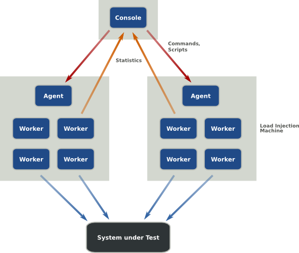

# Getting Started With The Grinder

Performance testing is important. 
In this blog post we will explain why, introduce you to a tool for testing performance called The Grinder, and take you through five examples which will get you started using Grinder for testing your web application.

The post is based on workshops held at [ROOTS](http://www.rootsconf.no/talks/42) and [FreeTest](http://free-test.org/node/81#2012051009-EspenHalvorsen), and the materials -- slides, tasks and code -- are of course [available on GitHub](https://github.com/kvalle/grinder-workshop).
To get the most out of the examples, you may want to follow along with the materials trying each task on your own, before reading the solutions we present here.

## So, Why Should I Test Performance?

*TODO: Espen*

## Why Grinder?

Okay, you get it already, performance testing is important!
But why should you use Grinder in particular?
And what is Grinder anyway?
Lets have a closer look.

Grinder is a load testing framework written in Java.
It is free, open source under a BSD-style licence, and supports large scale testing using distributed load injector machinces.
The main selling point of Grinder, however, is that it is lightweight and easy to use.
With Grinder there are no licences to buy or large environments to set up.
You just write a simple test script and fire up the grinder.jar file.

The reason you, as a developer, will prefer Grinder is that you create your tests in code, not some GUI.
Although Grinder itself is written in Java, the test scripts are written in Jython or Closure, which means you can utilize the expressiveness of a dynamic or functional language while still tapping into the resources of Java and the JVM.
(Of course, should you be so unfortunate not to be a developer, then Grinder might not be the tool for you. But you still need to understand why your developers want and should use Grinder!)

So, lets have a closer look on the nuts and bolts of Grinder.

## Grinder 101

The Grinder framework is comprised of three types of processes (or programs):

1. *Worker processes*: Interprets test scripts and performs the tests using a number of parallel *worker threads*.
1. *Agent processes*: Long running process that starts and stops worker processes as required.
1. *The Console*: Coordinates agent processes, and collates and displays statistics.



In this tutorial we'll keep things simple, and focus on the worker and agent precesses.
We will start an agent process manually, providing it with a test script and configuration, leaving the console and distributed testing out for now.

The test script is simply a Python (or Clojure) source file.
Grinder expects to find a class called `TestRunner` which should implement two methods: `__init__` and `__call__`.
The init-method is called by Grinder initially to set up the test, and call-method is then called repeatedly for each iteration of the testing.

### A Simple Example

Consider the code below.
This is the Grinder-equivalent of a "Hello World" program.
It defines a test script which will print the thread number of the worker thread and the string "hello world" each time it is triggered.

```python
from net.grinder.script.Grinder import grinder
from net.grinder.script import Test

# defining a simple "hello world" function, in order to have something to test
def hello_world():
    thread = grinder.getThreadNumber()
    print '> worker thread %d: hello world!' % thread

class TestRunner:
            
    def __init__(self):
        # creating a Grinder test object
        test = Test(1, "saying hello")
        # creating a proxy, by wrapping the hello world function with our Test-object
        self.wrapped_hello = test.wrap(hello_world)

    def __call__(self):
        # calling "hello world" through the wrapped function
        self.wrapped_hello() 
```

The important part to note in the above code is the `Test` object.
This object represents a basic operation of testing with Grinder.
We wrap our `hello_world` function with the test object, which tells Grinder to start timing and recording it.
Notice also that we are calling Grinder's wrapped version, not the function itself.

Next we need a test configuration.

    grinder.script = hello.py

    grinder.processes = 1
    grinder.threads = 4
    grinder.runs = 5

    grinder.useConsole = false
    grinder.logDirectory = log

Here we first tells Grinder which test script to run.
Then we specify that we only want one worker process started, and that the worker process should initiate four threads, each making five runs, i.e. calls to our `__call__` method.
The final two lines tell Grinder not to expect us to use the console (thus avoiding some output warnings) and where to put the log files describing the test results.

Now we are ready to run the test.
Start Grinder using the following command:

    java -cp lib/grinder.jar net.grinder.Grinder hello.properties

Or, more conveniently by using the [startAgent script](https://github.com/kvalle/grinder-workshop):

    ./startAgent.sh hello.properties

This should result in the printing of "hello world" a number of times and produce some files in the `log` directory.
The `data_xyz.log` file contains a detailed summary of the test events, while the `out_xyz.log` file provides a summary of the results.

             Tests    Errors   Mean Test    Test Time    TPS
                               Time (ms)    Standard
                                            Deviation
                                            (ms)

    Test 1   20       0        0.90         3.05         625.00    "saying hello"

    Totals   20       0        0.90         3.05         625.00

## Bootstrapping the Framework

*TODO: explain how to download the code from the workshop, and use it to follow along with the examples*

## Example 1 - Testing GET Response Time

In the first example, we will start simle by writing a test for GETing a single URL and measuring the response time.

First, we need some setup.
Like in the grinder 101 example, we start with a simple configuration file in `1.properties`.

    grinder.processes = 1
    grinder.threads = 1
    grinder.runs = 10
    
    grinder.useConsole = false
    grinder.logDirectory = log

    grinder.script = scripts/task1.py

The first group of properties specifies how much load the test will utilize.
The defaults for all three properties are 1. 
Our setup will run the test 10 times sequentially in a single thread.
The two next settings tells Grinder not to attempt connecting with the console and to store all log files in the `log` directory.
Finally, the last property informs Grinder about which test script to run.

We'll need to write this test script next.
Our `scripts/task1.py` should look something like this:

    from net.grinder.script.Grinder import grinder
    from net.grinder.script import Test
    from net.grinder.plugin.http import HTTPRequest

    class TestRunner:
        
        def __init__(self):
            test = Test(1, "GETing some webpage")
            self.request = test.wrap(HTTPRequest())
        
        def __call__(self):
            self.request.GET("http://foobar.example.com/page42")

We implement two methods: the `__init__` method for setting up the test, and the `__call__` method which is called by Grinder once per test run to be performed.

In the init-method we first crate a `Test` object and then use its `wrap` method to create a proxy object wrapping an instance of `HTTPRequest`.
This proxy is then stored as an instance variable `self.request`, ready for use in the test runs.

The reason we need to use the `Test` to create a proxy is in order for Grinder to be able to track what is happening.
Every method invoked on the proxy is recorded and timed by Grinder, before passing the call on to the wrapped object or function.

In this example, the call-method simply invoks the `GET` method on the proxy, which is then passed through to the `HTTPRequest` instance performing the actual request.

If you are following along with the [workshop materials](https://github.com/kvalle/grinder-workshop), you can now run the test by using the `startAgent` script.

    ./startAgent.sh tasks/1.properties
   

This should generate a few files in the `log` directory specified in the test configuration, where the results of the test are recorded.

## Example 2 - Testing multiple URLs

*TODO: Kjetil*

## Example 3 - Validating the responses

*TODO: Kjetil*

## Example 4 - Testing of a typical JSON-API (REST API)

*TODO: Espen*

## Example 5 - Using Grinder's TCPProxy to automatically generate tests

*TODO: Espen*

## Summary

*TODO: something to wrap everything up nicely*

---

Espen Herseth Halvorsen / Kjetil Valle
